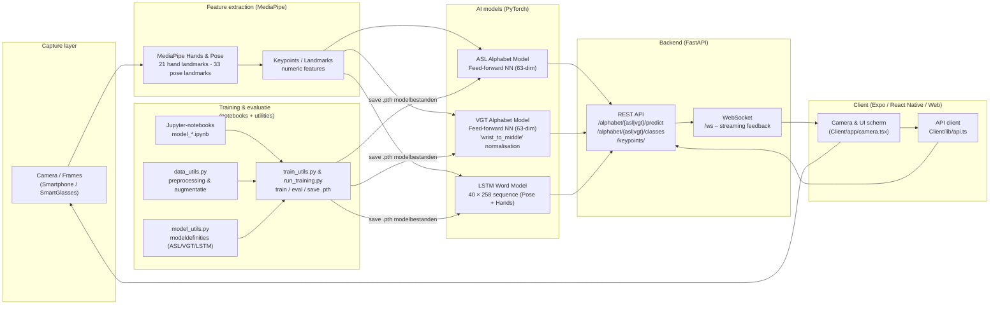

# Software Architectuur: AI-Componenten

## Inleiding & Scope

### Projectbeschrijving

Het **Signapse** project is een toegankelijkheidsoplossing die gebarentaal vertaalt naar tekst met behulp van een app op een mobiele telefoon. Het systeem maakt gebruik van computer vision en deep learning om handgebaren en gebarentaal in real-time te herkennen en te interpreteren.

### Scope van dit document

Dit document beschrijft uitsluitend de **AI-componenten** en hun integratie binnen de totale software-architectuur van het Signapse project. De focus ligt op:

- De deep learning modellen (ASL, VGT, LSTM)
- De MediaPipe feature extraction pipeline
- De API-laag die de AI-functionaliteit aanbiedt
- De gebruikte technologieën en frameworks

Voor een deep-dive in het `smart_gestures` package, model lifecycle en alle CLI-opties, zie [AI-Packages.md](./AI-Packages.md).

## Overzicht Architectuur

### High-level AI-architectuur

Het Signapse AI-systeem bestaat uit een **multi-model pipeline** die verschillende soorten gebaren kan herkennen:

1. **Alfabet-herkenning**: Individuele letters in American Sign Language (ASL) en Vlaams Gebarentaal (VGT)
2. **Woord-herkenning**: Volledige woorden via sequentiële keypoint-analyse met LSTM

Alle modellen zijn gebundeld in het `smart_gestures` Python package en worden aangeboden via een FastAPI backend.

### Contextdiagram



## AI-Componenten

### MediaPipe Keypoint-extractie

#### Rol in de architectuur

MediaPipe fungeert als **feature extractor** en is de eerste stap in de AI-pipeline. Het detecteert handen in afbeeldingen en extraheert gestructureerde 3D-coördinaten (keypoints/landmarks) die vervolgens door de classificatiemodellen gebruikt worden.

#### Technische implementatie

- **Library**: Google MediaPipe Hands (`mediapipe.python.solutions.hands`) — [MediaPipe Solutions Guide](https://ai.google.dev/edge/mediapipe/solutions/guide)
- **Configuratie**:
  - `static_image_mode=True`: Geoptimaliseerd voor enkele afbeeldingen
  - `max_num_hands=2`: Detecteert maximaal 2 handen
  - `min_detection_confidence=0.5`: Balans tussen precisie en recall
  - `min_tracking_confidence=0.5`: Minimale tracking threshold

#### Output

MediaPipe levert **21 hand landmarks** per gedetecteerde hand:

- **x, y**: Genormaliseerde 2D-coördinaten (0.0 - 1.0)
- **z**: Relatieve diepte ten opzichte van de pols

De 21 landmarks representeren:

- Pols (1 punt)
- Duim (4 punten)
- Wijsvinger (4 punten)
- Middelvinger (4 punten)
- Ringvinger (4 punten)
- Pink (4 punten)

#### Integratie (MediaPipe)

MediaPipe wordt gebruikt om keypoints te extraheren uit een dataset van afbeeldingen en video-frames. Deze keypoints worden vervolgens genormaliseerd en doorgegeven aan de deep learning modellen voor inferentie.

MediaPipe is eveneens geïntegreerd in de FastAPI backend via een dedicated router:

- `POST /keypoints/hands`: accepteert een afbeelding (multipart/form-data) en retourneert 21 hand-landmarks als JSON.
- `POST /keypoints/pose`: accepteert een afbeelding en retourneert een `LSTMFrame` met pose + linker/rechterhand landmarks voor sequentiële modellen.
- `POST /keypoints/` (root): deprecated; redirect naar `/keypoints/hands`.

```json
{
  "landmarks": [
    {"x": 0.5, "y": 0.6, "z": 0.0},
    ...
  ]
}
```

### ASL Alfabet Model

#### Modelarchitectuur (ASL)

- **Type**: Feed-forward Neural Network (PyTorch)
- **Framework**: PyTorch (`nn.Sequential`)
- **Architectuur**:

```label
  Input Layer:     63 features (21 landmarks × 3 coördinaten)
  Hidden Layer 1:  256 neuronen + ReLU + Dropout(0.2)
  Hidden Layer 2:  256 neuronen + ReLU + Dropout(0.2)
  Output Layer:    35 klassen
 ```

#### Klassen (ASL)

Het ASL-model herkent **35 klassen** (American Sign Language alfabet + cijfers):

- **Letters**: a-z (zonder bewegingen)
- **Cijfers**: 0-9
- **Totaal**: 35 statische gebaren
- **Opmerking**: De letter `q` ontbreekt in de huidige dataset omdat MediaPipe geen stabiele keypoints kon extraheren uit de gebruikte Kaggle-bron. Dit gebaar volgt zodra er betrouwbare trainingsdata beschikbaar is.

De klassen zijn gedefinieerd in `notebooks/package/smart_gestures/alphabet/asl_model/data/classes.json`.

#### Data preprocessing

**Normalisatie** (`normalize_landmarks` functie):

1. **Translatie**: Verplaats alle landmarks zodat de pols (index 0) op de oorsprong ligt
2. **Schaling**: Schaal op basis van de afstand tussen pols en middelvinger MCP (landmark 9)
3. **Flattenin**: Converteer naar 1D-array van 63 features

Deze normalisatie maakt het model **invariant** voor handpositie en -grootte.

#### Integratie (ASL Model)

- **Package**: `smart_gestures.alphabet.asl_model.ASLModel`
- **API-endpoint**: `/alphabet/asl/predict` (POST)
- **Input**: JSON met lijst van 21 landmarks
- **Output**: Voorspelde klasse (string)

#### Model-opslag (ASL)

- **Training**: `notebooks/training/asl_model/models/asl_alphabet_model.pth`
- **Package**: `notebooks/package/smart_gestures/alphabet/asl_model/models/asl_alphabet_model.pth`

Het model wordt automatisch geladen bij instantiatie van de `ASLModel` klasse.

### VGT Alfabet Model

#### Modelarchitectuur (VGT)

- **Type**: Feed-forward Neural Network (PyTorch)
- **Framework**: PyTorch (`nn.Sequential`)
- **Architectuur**: Identiek aan ASL-model

  ```label
  Input Layer:     63 features (21 landmarks × 3 coördinaten)
  Hidden Layer 1:  256 neuronen + ReLU + Dropout(0.2)
  Hidden Layer 2:  256 neuronen + ReLU + Dropout(0.2)
  Output Layer:    26 klassen
  ```

#### Klassen (VGT)

Het VGT-model herkent **26 klassen** (Vlaams Gebarentaal alfabet):

- **Letters**: a-z (zonder bewegingen)
- Deze klassen zijn gedefinieerd in `notebooks/package/smart_gestures/alphabet/vgt_model/data/classes.json`

#### Verschillen met ASL

| Aspect | ASL Model | VGT Model |
|--------|-----------|-----------|
| Klassen | 35 (a-z, 0-9) | 26 (A-Z) |
| Gebarentaal | American Sign Language | Vlaams Gebarentaal |
| Architectuur | Identiek | Identiek |
| Preprocessing | Identiek | Identiek |

Hoewel de **modelarchitectuur identiek** is, zijn de modellen getraind op verschillende datasets en herkennen ze verschillende gebaren uit verschillende gebarentalen. Het VGT-model werkt met callbacks die er voor zorgen dat het model niet overfit op de trainingsdata, vroeger stopt en de confidence scores beter kalibreert.

#### Integratie (VGT Model)

- **Package**: `smart_gestures.alphabet.vgt_model.VGTModel`
- **API-endpoint**: `/alphabet/vgt/predict` (POST)
- **Input**: JSON met lijst van 21 landmarks
- **Output**: Voorspelde klasse (string)

#### Model-opslag (VGT)

- **Training**: `notebooks/training/vgt_model/models/vgt_alphabet_model.pth`
- **Package**: `notebooks/package/smart_gestures/alphabet/vgt_model/models/vgt_alphabet_model.pth`

### LSTM Woord/Gebaar Model

#### Modelarchitectuur (LSTM)

- **Type**: Recurrent Neural Network (LSTM)
- **Framework**: PyTorch (`nn.LSTM`)
- **Architectuur**:
  
  ```label
  Input:          Sequentie van 40 frames × 258 features
  LSTM Layer 1:   128 hidden units + Dropout(0.2)
  LSTM Layer 2:   128 hidden units + Dropout(0.2)
  Fully Connected: 128 → 5 klassen
  Output:         5 woordklassen + confidence score
  ```

#### Klassen (LSTM)

Het LSTM-model herkent **5 VGT-woorden**:

1. **goed**
2. **hallo**
3. **ja**
4. **nee**
5. **tot_ziens**

Deze mapping is gedefinieerd in `notebooks/package/smart_gestures/gestures/lstm_model/data/gesture_map.json`.

#### Input-formaat

Het LSTM-model verwerkt **sequenties** van keypoints, niet individuele frames:

- **Sequentielengte**: 40 frames (vast)
- **Features per frame**: 258
  - **Pose keypoints**: 33 landmarks × 4 coördinaten = 132 features
  - **Linkerhand**: 21 landmarks × 3 coördinaten = 63 features
  - **Rechterhand**: 21 landmarks × 3 coördinaten = 63 features

#### Data preprocessing (LSTM)

**Normalisatie** (`normalize_landmarks` functie):

1. Extract hand keypoints uit volledige sequentie
2. **Centreer** op basis van pols eerste frame
3. **Schaal** op basis van pols-middelvinger afstand
4. Concateneer genormaliseerde hand-keypoints met originele pose-keypoints

Deze preprocessing behoudt **temporele informatie** en maakt het model robuust tegen positie- en schaalvariaties.

#### Sequentie-handling

- **Padding**: Kortere sequenties worden gepad naar lengte 40
- **Truncation**: Langere sequenties worden ingekort tot lengte 40
- **Pack/Unpack**: Gebruik van `pack_padded_sequence` voor efficiënte LSTM-verwerking

#### Integratie (LSTM Model)

- **Package**: `smart_gestures.gestures.lstm_model.LSTMModel`
- **API-endpoint**: `/gestures/lstm/predict` (POST)
- **Input**: JSON met sequentie van frames (elk frame bevat 258 features)
- **Output**: Voorspelde woord + confidence score (0.0 - 1.0)

#### Model-opslag (LSTM)

- **Training**: `notebooks/training/lstm_model/models/lstm_model.pth`
- **Package**: `notebooks/package/smart_gestures/gestures/lstm_model/models/lstm_model.pth`

## Gebruikte Technologieën en Frameworks

### Core AI/ML Stack

| Technologie | Versie | Rol | Voordelen |
|------------|--------|-----|-----------|
| **PyTorch** | 2.7.0 | Deep learning framework | - Flexibele modelarchitectuur; - Dynamische computation graphs; - Sterke community support; - Eenvoudige model serialisatie (.pth) |
| **MediaPipe** | 0.10.21 | Computer vision + keypoint extraction | • Real-time performance; • Pre-trained hand detection; • Robuuste landmark tracking; • Cross-platform support |
| **NumPy** | 1.26.4 | Numerieke operaties | Efficiënte array-operaties; Basis voor PyTorch tensors; Data preprocessing |
| **OpenCV (cv2)** | 4.11.0.86 | Image processing | Image decoding (JPEG/PNG); Color space conversies (BGR↔RGB); Basis image manipulatie |
| **Pandas** | 2.3.3 | Data handling (training) | Dataset management; CSV/JSON I/O; Data augmentatie |

### Package Management

Het `smart_gestures` package:

- **Structuur**: Hierarchische module-organisatie
  
  ```label
  smart_gestures/
  ├── alphabet/
  │   ├── asl_model/
  │   └── vgt_model/
  └── gestures/
      └── lstm_model/
  ```

- **Distributie**: PyPI package ([smart_gestures](https://pypi.org/project/smart_gestures/))
- **Versioning**: Semantic versioning
- **Dependencies**: Gedeclareerd in `pyproject.toml`

### Model Serialisatie

**PyTorch `.pth` formaat**:

- **Voordelen**:
  - Native PyTorch format
  - Inclusief `state_dict` (model weights)
  - Klein bestandsformaat (5-20 MB per model)
  - Makkelijk laden met `torch.load()`
- **Locatie**: `models/` directories binnen elk model-subpackage

### Waarom deze technologieën?

#### PyTorch

- **Flexibiliteit**: Custom LSTM architectuur, eenvoudige debugging
- **Research-vriendelijk**: Snel prototypen en experimenteren
- **Production-ready**: Goede performance, mobile deployment mogelijk

#### MediaPipe

- **Snelheid**: Geoptimaliseerd voor real-time (60+ FPS mogelijk)
- **Accuratesse**: State-of-the-art hand tracking
- **Gebruiksgemak**: Eenvoudige API voor integratie

## Kwaliteitsaspecten & Uitbreidbaarheid

### Modulaire Architectuur

De AI-componenten zijn **sterk ontkoppeld** via het `smart_gestures` package:

- Elk model is een zelfstandig subpackage
- Uniforme interface: `get_classes()`, `predict()`
- Makkelijk toevoegen van nieuwe modellen zonder bestaande code te wijzigen

### Uitbreidingsmogelijkheden

#### Nieuw Gebarentaal-Model Toevoegen

**Stappen**:

1. **Training**: Train model in `notebooks/training/nieuwe_taal_model/`
2. **Package**: Kopieer model naar `notebooks/package/smart_gestures/alphabet/nieuwe_taal_model/`
3. **Interface**: Implementeer `Model` klasse met `predict()` en `get_classes()`
4. **API**: Registreer nieuwe router in `server/src/routes/alphabet/nieuwe_taal_model/__init__.py`
5. **Import**: Add route naar `server/src/main.py`

**Benodigde bestanden**:

```label
smart_gestures/alphabet/nieuwe_taal_model/
├── __init__.py          # Exporteer Model en get_classes
├── model.py             # Model klasse + utilities
├── data/
│   └── classes.json     # Label mapping
└── models/
    └── model.pth        # Trained weights
```

#### Extra LSTM Woorden Toevoegen

**Stappen**:

1. **Data verzamelen**: Gebruik `notebooks/utilities/capture_dataset_lstm.py`
2. **Retrain**: Run `notebooks/training/lstm_model/run_training.py` met nieuwe data
3. **Update mapping**: Pas `data/gesture_map.json` aan met nieuwe woorden
4. **Deploy**: Kopieer nieuwe model.pth naar package

Geen code-wijzigingen nodig in de API—de `/lstm/classes` endpoint leest automatisch de nieuwe mapping.

### Performance Overwegingen

#### Latency

- **MediaPipe extractie**: ~50-100ms per frame (CPU)
- **Model inferentie**:
  - ASL/VGT: ~5-10ms (CPU)
  - LSTM: ~10-20ms (CPU)
- **Totale pipeline**: ~60-130ms (voldoende voor near-real-time gebruik)

#### Optimalisaties

- **Persistent MediaPipe instance**: Vermijdt re-initialisatie overhead
- **Batch processing**: Mogelijk voor multiple predictions (niet geïmplementeerd)
- **Model quantization**: PyTorch biedt INT8 quantization voor kleinere models (toekomstig)
- **ONNX export**: Voor cross-platform deployment (mobiel, embedded)

#### Resource-gebruik

- **Memory**: ~200-300 MB per model geladen
- **CPU**: Single-threaded inferentie (mogelijkheid voor threading bij hogere throughput)
- **GPU**: Niet vereist (belangrijk voor edge devices)

### Model Versioning

**Huidige aanpak**:

- Model weights opgeslagen als `.pth` files
- Versie-tracking via Git

**Toekomstige verbeteringen**:

- Model registry (bijv. MLflow, Weights & Biases)
- A/B testing infrastructure
- Automated retraining pipelines

### Testing & Validatie

#### Unit Tests

Mogelijke test-coverage:

- Data preprocessing (normalisatie, augmentatie)
- Model loading (check architectuur, weights)
- Endpoint validatie (correcte responses)

#### Integration Tests

- End-to-end pipeline: image → keypoints → prediction
- Error handling: ongeldige inputs, edge cases

#### Model Performance

- **Training metrics**: Accuracy, loss curves (zie `notebooks/training/`)
- **Validation**: Hold-out test set evaluatie
- **Calibration**: Confidence scores afstemmen op echte accuratesse

## Conclusie

De AI-architectuur van het Signapse project combineert **moderne deep learning technieken** met **pragmatische software engineering**:

- **MediaPipe** als robuuste feature extractor
- **PyTorch feed-forward networks** voor snelle alfabet-herkenning (ASL + VGT)
- **PyTorch LSTM** voor contextuele woord-herkenning
- **Modulaire package-structuur** voor eenvoudige uitbreidbaarheid
- **REST API** voor platform-agnostische integratie
- **Real-time performance** op CPU-only devices

De architectuur is ontworpen met **schaalbaarheid** en **onderhoudbaarheid** in gedachten, waardoor nieuwe modellen, talen of functies eenvoudig toegevoegd kunnen worden zonder grote refactoring.

---

**Document-informatie**:

- **Versie**: 1.2
- **Datum**: December 2025
- **Auteurs**: Lynn Delaere
- **Contact**: Zie [GitHub repository](https://github.com/vives-project-xp/Signapse)
