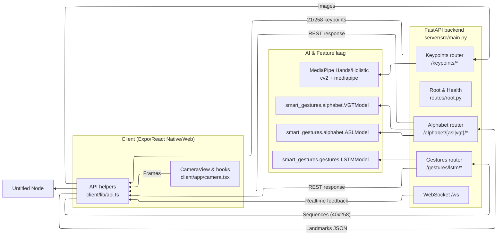

# Software Architectuur: FastAPI Backend

## Inleiding & Scope

### Projectbeschrijving

Het **Signapse** platform vertaalt gebarentaal naar tekst via een combinatie van computer vision, deep learning en een mobiele/webclient. De backend levert een uniforme **FastAPI**-laag die mediastreams van de client verwerkt, keypoints extraheert, AI-modellen aanroept en resultaten terugstuurt in realtime.

### Scope van dit document

Dit document beschrijft de **backendlaag** die de frontends aanstuurt:

- FastAPI-applicatie, routers en lifecycle (`server/src/main.py`)
- Integratie met het `smart_gestures` AI-package
- Request/response-validatie via Pydantic schema's
- Endpoints (REST + WebSocket) inclusief doel en contracten
- Datastromen tussen client, keypoint-service en inferentie-modellen

Voor details over de AI-modellen zelf, zie [AI-Architecture.md](./AI-Architecture.md).

## Overzicht Architectuur

### High-level backend-architectuur

De backend bestaat uit een **gelaagde FastAPI-app**:

1. **Transportlaag**: REST & WebSocket endpoints, CORS, versiebeheer.
2. **Routerlaag**: Logische modules (`root`, `keypoints`, `alphabet`, `gestures`, `ws`) met eigen prefixes en tags.
3. **Service/AI-laag**: Aanroepen naar `smart_gestures` (ASL/VGT feed-forward modellen + LSTM voor woorden) en MediaPipe detectors voor keypoints.
4. **Validatielaag**: Pydantic schema's die vorm en constraints afdwingen (aantal landmarks, sequentielengte, etc.).

Alle zware objecten (MediaPipe detectors, PyTorch-modellen) worden **éénmalig geinitialiseerd** bij import zodat elk request enkel inference uitvoert.

### Contextdiagram

## Kerncomponenten

### FastAPI-applicatie & runtime

- Entry point: `server/src/main.py`
  - Stelt logging/waarschuwingen in en dwingt CPU-mode af voor MediaPipe/TensorFlow.
  - Initialiseert `FastAPI` met titel, beschrijving en `__version__` (gelezen uit `pyproject.toml` via `const.py`).
  - Registreert CORS (`allow_origins=["*"]`) zodat web en mobiele clients kunnen verbinden tijdens development.
  - Includeert routers (`root`, `ws`, `alphabet`, `gestures`, `keypoints`).
- Deployment: `server/Dockerfile` bouwt een Python 3.12 container, installeert `smart-gestures` als lokaal package en start via `fastapi run src/main.py --host 0.0.0.0 --port 8000`.
- Runtime dependencies (uit `server/pyproject.toml`):
  - `fastapi[standard]`, `uvicorn`, `pydantic`
  - `smart-gestures==0.3.3` (bundelt getrainde modellen)
  - Tools voor linting/typing (black, isort, mypy, flake8) voor kwaliteitsborging

### Routerlagen

| Router | Prefix | Belangrijkste verantwoordelijkheden | Files |
|--------|--------|-------------------------------------|-------|
| `root` | `/` | Health-check, versie-informatie, redirects | `routes/root.py` |
| `keypoints` | `/keypoints` | MediaPipe integratie voor hands & pose, beeldvalidatie | `routes/keypoints/__init__.py` |
| `alphabet` | `/alphabet` | ASL/VGT klassen & predictions | `routes/alphabet/asl_model`, `vgt_model` |
| `gestures` | `/gestures` | LSTM woordherkenning (klassen + predict) | `routes/gestures/lstm_model` |
| `ws` | `/ws` | Stateful WebSocket kanaal voor realtime feedback | `routes/ws/connection.py`, `websocket/connection_manager.py` |

### Validatie & schema's

- Alle requests/responses gebruiken Pydantic schema's (`server/src/schemas`).
- `PredictBody` dwingt exact 21 `HandLandmark` entries af (`NUM_POINTS`).
- `LSTMPredictBody` valideert 40 frames met `field_validator` en zet data om naar een `numpy`-array (`to_numpy_sequence()`).
- `HandKeypointsResponse`, `PoseLandmark` en `LSTMFrame` standaardiseren MediaPipe output zodat frontend en backend dezelfde structuur delen.
- `StatusResponse`, `ClassesResponse` en `LSTMClassesResponse` documenteren metadata voor automatische OpenAPI docs.

### AI-integratie (smart_gestures)

- De `smart_gestures` package wordt via een lokale path dependency geladen (`[tool.uv.sources]`).
- Modellen (`ASLModel`, `VGTModel`, `LSTMModel`) laden `.pth` bestanden bij import en bieden een `.predict(...)` API die `(naam, confidence)` teruggeeft.
- De routers converteren Pydantic objecten naar Python lijsten/dicts vóór inferentie.
- Normalisatie (translatie, scaling) en tensor-conversies zitten in het package zodat de backend puur orchestration doet.

### WebSocket infrastructuur

- `routes/ws/connection.py` exposeert `/ws` en gebruikt `ConnectionManager`.
- `ConnectionManager` houdt `active_connections: dict[str, WebSocket]` bij, accepteert clients, broadcast berichten en verwijdert clients bij disconnect.
- Dit kanaal is voorlopig bedoeld voor notificaties/experimentele realtime feedback maar de infrastructuur is klaar voor streaming predictions.

### Foutafhandeling & observability

- Inputfouten worden vertaald naar `HTTPException`:
  - `400` bij lege bestanden of verkeerde landmark-aantallen.
  - `404` als er geen hand/pose gevonden wordt.
  - `500` bij onverwachte predictieproblemen (LSTM).
- Alle responses zijn JSON en beschreven in de OpenAPI-spec (`/docs` & `/redoc`).
- Logging van `absl`, `tensorflow` en `mediapipe` is onderdrukt in `main.py` om bruikbare logs over te houden voor backend events.

## Endpointcatalogus

### Root & status

| Endpoint | Methode | Doel | Request | Response |
|----------|---------|------|---------|----------|
| `/` | GET | Redirect naar `/health` als startpunt voor monitoring. | - | `307` Redirect |
| `/health` | GET | Geeft API-versie terug (monitorable via load balancers). | - | `{ "version": "0.3.2" }` (`StatusResponse`) |

### Keypoints (MediaPipe)

| Endpoint | Methode | Doel | Request | Response |
|----------|---------|------|---------|----------|
| `/keypoints/` | POST | Backwards compat. endpoint dat direct redirect naar `/keypoints/hands`. | `multipart/form-data` met `image` | `307` Redirect |
| `/keypoints/hands` | POST | Extraheert **21 hand-landmarks** via MediaPipe Hands. | `multipart/form-data`, single frame (JPEG/PNG). Validatie op lege bestanden. | `HandKeypointsResponse` (21 × `{x,y,z}`) |
| `/keypoints/pose` | POST | Bouwt één `LSTMFrame` (pose + beide handen) voor sequential models. | `multipart/form-data` met frame. | `LSTMFrame` (33 pose + 2×21 hand landmarks). |

Technische highlights:
- `prepare_image()` decodeert bytes → `numpy` → RGB.
- Persistente MediaPipe detectors vermijden init-overhead per request.

### Alphabet (ASL/VGT)

| Endpoint | Methode | Doel | Request | Response |
|----------|---------|------|---------|----------|
| `/alphabet/asl/classes` | GET | Geeft lijst van 35 ASL-klassen uit het model JSON. | - | `ClassesResponse` (`["a","b",...]`) |
| `/alphabet/asl/predict` | POST | Voorspelt ASL-letter/cijfer op basis van 21 landmarks. | `PredictBody` (`landmarks: list[HandLandmark]`) | `PredictResponse` (`prediction`, `confidence`) |
| `/alphabet/vgt/classes` | GET | Geeft lijst van VGT-klassen. | - | `ClassesResponse` |
| `/alphabet/vgt/predict` | POST | Voorspelt VGT-letter (wrist-to-middle normalisatie in model). | `PredictBody` | `PredictResponse` |

Binnenkomende landmarks worden geconverteerd naar dicts met `.model_dump()` en vervolgens aan het betreffende model doorgegeven. Exceptions worden vertaald naar `400 Bad Request`.

### Gestures (LSTM woordherkenning)

| Endpoint | Methode | Doel | Request | Response |
|----------|---------|------|---------|----------|
| `/gestures/lstm/classes` | GET | Geeft mapping van gebaren → class-id (voor UI dropdowns). | - | `LSTMClassesResponse` (`{ "hallo": 3, ... }`) |
| `/gestures/lstm/predict` | POST | Voorspelt woorden uit sequenties van 40 frames. | `LSTMPredictBody` (`frames: list[LSTMFrame]`) | `LSTMPredictResponse` (`prediction`, `confidence`) |

`LSTMPredictBody.to_numpy_sequence()` zet de frames om naar `numpy (40, 258)` voordat `model.predict()` wordt aangeroepen. Inputvalidatie onderscheidt tussen `ValueError` (400) en andere fouten (500).

### WebSocket

| Endpoint | Type | Doel | Payload | Gedrag |
|----------|------|------|---------|--------|
| `/ws` | WebSocket | Bi-directionele kanaal voor realtime feedback of multi-user sessies. | Vrij tekstprotocol (nu broadcast). | Iedere binnenkomende message wordt naar alle clients gestuurd; connect/disconnect events worden automatisch gebroadcast. |

Gebruik `ConnectionManager` om toekomstige features zoals push-notificaties voor predictions te implementeren.

## Datastromen & Sequenties

### Alfabet-herkenning (ASL/VGT)

1. **Frame capture** in `client/app/camera.tsx`.
2. **Upload frame** → `POST /keypoints/hands`; backend decodeert bytes, draait MediaPipe Hands en retourneert 21 landmarks.
3. **Client valideert** response en bouwt `PredictBody`.
4. **Client → /alphabet/{asl|vgt}/predict** met landmarks.
5. **Router** converteert landmarks naar lijst dicts, roept `ASLModel` of `VGTModel` aan:
   - Normalisatie & tensorconversie gebeurt in `smart_gestures`.
   - Softmax → confidence, mapping naar klasse.
6. **Response** (`prediction`, `confidence`) wordt in UI getoond en eventueel gebruikt om woorden op te bouwen.

### Woord-herkenning (LSTM)

1. **Sequencing**: client verzamelt 40 opeenvolgende frames en extraheert per frame pose + hand-landmarks (kan bouwstenen hergebruiken van `/keypoints/pose`).
2. **Request** naar `/gestures/lstm/predict` met `frames`.
3. **Validatie**: `LSTMPredictBody` checkt lengte en structuren en zet om naar `(40,258)` numpy-array.
4. **Inferentie**: `LSTMModel.predict()` draait normalisatie, voert forward pass, berekent confidence.
5. **Response** bevat `prediction` + `confidence`. Frontend toont woord + probabiliteit of annuleert als drempel niet gehaald wordt.

### WebSocket feedback

1. Client opent `ws://<host>/ws` en ontvangt bevestiging.
2. Elke message (bv. "prediction: hallo") wordt gebroadcast naar alle aangesloten clients.
3. Disconnects worden opgeschoond door `ConnectionManager`.
4. Dankzij deze infrastructuur kan de backend later streaming predictions pushen zonder extra endpoints.

## Client-integratie & Deployability

- **Client code**:
  - API-helper: `client/lib/api.ts` (fetch wrappers, JSON parsing, error handling).
  - Camera workflow: `client/app/camera.tsx` en hooks bouwen de pipeline uit sectie hierboven.
  - UI logica combineert alphabet predictions tot woorden of triggert LSTM-requests.
- **CORS & Security**:
  - Alle origins zijn toegestaan tijdens development; productieconfig kan `allow_origins` beperken tot vertrouwde domeinen/apps.
  - File uploads verlopen via HTTPS om fotogegevens te beschermen.
- **Versiebeheer & observability**:
  - `/health` exposeert `__version__` zodat monitoring kan checken of de juiste release draait.
  - `fastapi[standard]` levert automatische Swagger UI op `/docs` en ReDoc op `/redoc`, bruikbaar voor QA en integrators.
- **Containerisatie**:
  - Dependencies (cv2, MediaPipe) vereisen systeemlibraries (`libgl1`, `libglib2.0-0`), vastgelegd in de Dockerfile.
  - Environ-variabelen zoals `MPLCONFIGDIR` en `TMPDIR` worden ingesteld zodat MediaPipe en matplotlib kunnen schrijven in sandbox directories.

---

**Document-informatie**:

- **Versie**: 1.0
- **Datum**: December 2025
- **Auteurs**: Lynn Delaere
- **Contact**: Zie [GitHub repository](https://github.com/vives-project-xp/Signapse)
