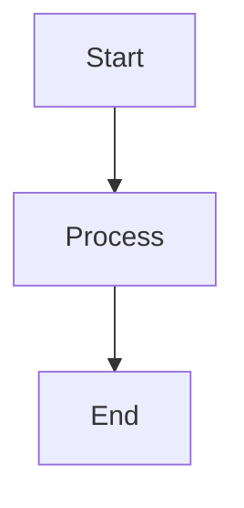

# MkDocs Structure Guide

This document provides a comprehensive overview of how the MkDocs documentation system is structured and configured in the Smart Glasses project.

## Directory Structure

```text
SmartGlasses/
├── config/mkdocs/              # MkDocs configuration files
│   ├── mkdocs.yml              # Main MkDocs configuration
│   └── Dockerfile              # Docker container definition
├── docs/                       # Documentation content
│   └── ...                     # Documentation sections
├── assets/                     # Static assets (images, logos, etc.)
│   ├── favicon.ico             # Site favicon
│   └── smart_glasses_logo.webp # Project logo
├── docker-compose.yaml         # Service orchestration
└── README.md                   # Project root documentation
```

## Configuration Architecture

### 1. Main Configuration (`config/mkdocs/mkdocs.yml`)

This is the heart of the MkDocs setup, defining:

#### Site Information

```yaml
site_name: Documentation - Smart Glasses
site_description: Comprehensive documentation for the Smart Glasses project
site_author: Simon Stijnen
repo_url: https://github.com/vives-project-xp/SmartGlasses
copyright: Copyright &copy; 2025 Vives
```

#### File Structure

```yaml
docs_dir: /docs  # Points to the documentation root directory
```

#### Theme Configuration

- **Base Theme**: Material for MkDocs
- **Color Scheme**: Red primary, pink accent
- **Dark/Light Mode**: Automatic system preference detection with manual toggle
- **Features Enabled**:
  - Navigation tabs and sections
  - Integrated table of contents
  - Search suggestions and highlighting
  - Code copying and annotations
  - Content tabs linking

#### Markdown Extensions

- **Syntax Highlighting**: `pymdownx.highlight` with line numbers
- **Code Features**: Inline highlighting, snippets, superfences
- **Diagrams**: Mermaid diagram support through custom fences
- **Content Enhancement**: Tables, admonitions, footnotes
- **Navigation**: Table of contents with permalinks

#### Plugins

- **Search**: Full-text search functionality

### 2. Docker Configuration (`config/mkdocs/Dockerfile`)

The containerization strategy includes:

#### Base Image

```dockerfile
FROM python:3.11-alpine
```

- Lightweight Alpine Linux base
- Python 3.11 for modern compatibility

#### Dependencies

```dockerfile
RUN pip install --no-cache-dir mkdocs-material
```

- MkDocs Material theme (includes MkDocs core)
- No cache to minimize image size

#### File Structure Setup

```dockerfile
WORKDIR /docs
COPY config/mkdocs /config
COPY /assets /docs/assets
COPY /README.md /docs/README.md
COPY /docs /docs
```

#### Service Configuration

```dockerfile
EXPOSE 8000
CMD ["mkdocs", "serve", "--config-file", "/config/mkdocs.yml", ...]
```

### 3. Service Orchestration (`docker-compose.yaml`)

#### Service Definition

```yaml
services:
  docs:
    container_name: docs
    build:
      context: .
      dockerfile: config/mkdocs/Dockerfile
    restart: unless-stopped
    user: "${UID:-1000}:${GID:-1000}"
    ports:
      - "8085:8000"
    environment:
      - ENABLE_LIVE_RELOAD=true
```

**Key Features**:

- **Port Mapping**: External port 8085 → Internal port 8000
- **User Mapping**: Preserves file permissions with host user/group
- **Auto-Restart**: Container restarts automatically unless manually stopped
- **Live Reload**: Enabled for development convenience

## Content Organization

Documentation files are stored in the `/docs` directory, organized by topic or project component. Each section can contain multiple Markdown files, which MkDocs automatically converts into a navigable website.

Assets are:

- Copied into the Docker container at build time
- Referenced in MkDocs configuration
- Accessible to all documentation pages

## Development Workflow

### 1. Local Development

Start the documentation server.

```bash
docker-compose up docs

```

Access at <http://localhost:8085>.

Changes auto-reload in browser.

### 2. Content Creation

- Add new documentation files to /docs directory
- Use Markdown syntax
- Reference images in /assets directory

### 3. Configuration Updates

1. Modify `config/mkdocs/mkdocs.yml`.
1. Rebuild container if needed.

```bash
docker-compose build docs
docker-compose up docs
```

## Advanced Features

### Mermaid Diagrams

Enabled through configuration:

```yaml
markdown_extensions:
  - pymdownx.superfences:
      custom_fences:
        - name: mermaid
          class: mermaid
          format: !!python/name:pymdownx.superfences.fence_code_format
```

Usage in Markdown:

````markdown

````

Result:


### Code Highlighting

Multiple programming languages supported:

````markdown
```python
def hello_world():
    print("Hello, Smart Glasses!")
```
````

Result:

```python
def hello_world():
    print("Hello, Smart Glasses!")
```

### Admonitions

Enhanced content blocks:

```markdown
!!! note "Important Information"
    This is a note admonition block.

!!! warning
    This is a warning block.
```

Result:

!!! note "Important Information"
    This is a note admonition block.

!!! warning
    This is a warning block.

## Customization Points

### Theme Customization

- Colors and branding in `mkdocs.yml`
- Custom CSS through theme overrides
- Logo and favicon replacement

### Navigation Structure

- Automatic from file structure
- Manual override in `mkdocs.yml` nav section
- Section grouping and ordering

### Plugin Extensions

- Additional plugins via `pip install` in Dockerfile
- Plugin configuration in `mkdocs.yml`
- Custom plugin development possible

## Deployment Considerations

### Production Deployment

- Static site generation: `mkdocs build`
- Serve static files with web server (Nginx, Apache)
- CI/CD integration for automatic builds

### Performance Optimization

- Asset optimization
- Search index tuning
- Plugin selection and configuration

### Security

- No server-side processing required
- Static files reduce attack surface
- Container isolation provides additional security

## Troubleshooting

### Common Issues

1. **Port Conflicts**: Change port mapping in `docker-compose.yaml`
2. **Permission Issues**: Check UID/GID mapping in Docker Compose
3. **Build Failures**: Verify Dockerfile syntax and dependencies
4. **Configuration Errors**: Validate YAML syntax in `mkdocs.yml`

### Debug Mode

Enable verbose logging:

```bash
# In Dockerfile CMD
mkdocs serve --config-file /config/mkdocs.yml --verbose
```

### Log Access

```bash
# View container logs
docker-compose logs docs

# Follow logs in real-time
docker-compose logs -f docs
```

This structure provides a robust, scalable documentation system that grows with the Smart Glasses project while maintaining simplicity for contributors.
