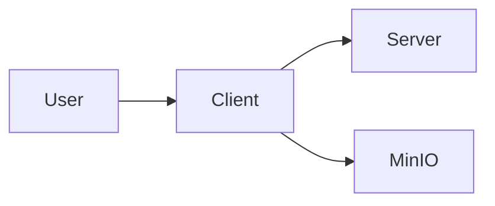

# Client — Service documentation

Service documentation for the client is maintained in the Deployment Services directory: [../services/client.md](../services/client.md).

## Technology Deep Dive (The "What")

Web frontends and static sites are common ways to deliver client applications. A static build contains pre-rendered HTML, JavaScript and assets that are served via an HTTP server or an object storage-backed static host. In Kubernetes this can be implemented using a `Deployment` that runs an Nginx or other lightweight server, or by uploading files to object storage and serving them from an Ingress or CDN.

Core terms include build artifacts (the compiled assets), CDN or caching for fast delivery, and HTTP routing via Ingress. For device-focused clients (like Expo-based apps), the cluster may serve APIs that the client communicates with rather than hosting the app itself.

Choosing a static hosting approach reduces server-side resource needs and simplifies scaling because the content is cacheable and served as plain files.

## Service Implementation (The "Why Here")

In Signapse the client can be deployed as a static site for the web interface, or developers may run Expo locally. When deployed into K3s it is often served by a small web server that provides the built assets and routes for single-page applications.

Example: A CI job builds the client into static assets, and the cluster Deployment pulls the image containing an Nginx server that serves the files at `/`.

## Usage Guide (The "How")

Deploy the client build artifacts as a Kubernetes `Deployment` and verify its `Ingress` or `Service`.

```bash
# Apply client manifests
kubectl -n default apply -f k8s/client.deployment.yaml -f k8s/client.service.yaml -f k8s/client.ingress.yaml

# Check rollout
kubectl -n default rollout status deploy/client

# Open the web UI through the configured ingress
```

The `apply` command creates cluster objects; `rollout status` confirms the Deployment is ready. Access is via the Ingress domain configured for your cluster.

### Configuration Reference

| Variable | Default Value | Description |
|---|---:|---|
| PORT | 80 | Port the static server listens on |
| INGRESS_HOST | (configured in cluster) | Hostname used by the Ingress to expose the site |

### Access

When exposed by an Ingress the client is reachable at the configured hostname. Inside the cluster it can be accessed via the `client` Service as well.

## Connections (The Ecosystem)

The client consumes APIs from the server and pulls static assets or media from MinIO or lakeFS when necessary. It is the primary interaction point for users and thus must be reachable with low latency and proper caching.



## Kubernetes Deployment Architecture

A static client is best deployed as a `Deployment` running a simple HTTP server (Nginx) with a `Service` and an `Ingress` for external access. Because it is stateless and cacheable, horizontal scaling is straightforward and often unnecessary beyond a few replicas. Using an `Ingress` allows TLS termination and host-based routing; alternatively, serving static files from an object storage bucket exposed via Ingress can reduce compute needs. The cluster IP for the `Service` will be drawn from the 10.26.20.1–10 range, which makes in-cluster routing predictable.
