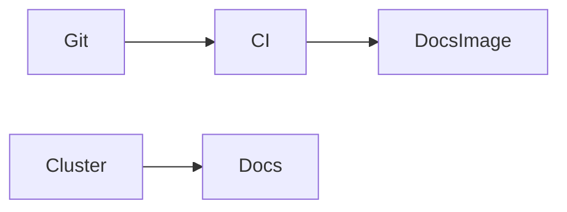

# Docs — Service documentation

Service documentation for the documentation site is maintained in the Deployment Services directory: [../services/docs.md](../services/docs.md).

## Technology Deep Dive (The "What")

MkDocs converts Markdown into static HTML that can be served by any HTTP server. Deploying MkDocs output into Kubernetes is usually achieved by building the static site during CI and placing the generated files in an image or on object storage. Important concepts include build-time vs runtime: MkDocs is a build-time tool, while the web server is a runtime concern that simply serves files.

Serving documentation via Kubernetes allows teams to leverage the cluster's Ingress, TLS and routing for a simple and secure public-facing site.

## Service Implementation (The "Why Here")

In Signapse the docs site is consumed by contributors and operators as the single source of truth. Deploying it in the cluster ensures consistent availability and allows the docs to reference internal hostnames and services directly when appropriate.

Example: CI generates the documentation site and pushes the artifacts to a container image; the cluster Deployment serves it behind an Ingress and TLS.

## Usage Guide (The "How")

Deploy the built site and expose it via an Ingress.

```bash
# Build the static site locally (or in CI)
mkdocs build -d site

# Build a container image that serves the files, then deploy
docker build -t docs:latest -f config/mkdocs/Dockerfile .
kubectl -n default apply -f k8s/docs.deployment.yaml -f k8s/docs.service.yaml -f k8s/docs.ingress.yaml
```

The build step produces static files; the image packaging and Deployment puts the site into the cluster for consumption.

### Configuration Reference

| Variable | Default Value | Description |
|---|---:|---|
| PORT | 8000 | Internal HTTP port used by the server image |

### Access

When the site is exposed via an Ingress it is reachable at the configured hostname and will typically be available with TLS handled by the cluster Ingress controller.

## Connections (The Ecosystem)

Docs are read-only but link to other services and include operational instructions for interacting with the cluster. The documentation itself may be stored in Git and built by CI pipelines that run on merges to the documentation branch.



## Kubernetes Deployment Architecture

Because the MkDocs output is static the site is best deployed as a `Deployment` that serves static assets, paired with a `Service` and an `Ingress` for TLS and host routing. Alternatively, the static files can be hosted from an object store and served through an Ingress. The cluster IP range (10.26.20.1–10) provides stable in-cluster addressing for any Services the docs may refer to during internal documentation references.
