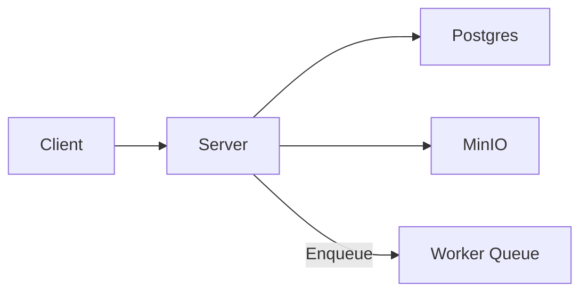

## Server (K3s) — Executive Summary

The server provides the API surface, WebSocket endpoints, and integration points for ML inferences. In K3s it is deployed to scale and integrate with other cluster services such as databases and object storage.

## Technology Deep Dive (The "What")

A modern Python web service typically exposes REST endpoints and WebSocket connections. REST provides a request/response model for CRUD operations and short-lived interactions; WebSockets enable persistent, bidirectional communication for low-latency notifications and streaming. Important terms include API (the contract of endpoints), routing (how requests are dispatched), and middleware (components that handle cross-cutting concerns like auth and logging).

When deployed in Kubernetes, stateless server pods are usually managed by a `Deployment` with a `Service` fronting them; this allows horizontal scaling, rolling updates and health checks via readiness and liveness probes. For longer-running tasks, background workers or Jobs are used to ensure work queues can be processed independently of the web front.

Servers are universally used in this role because they provide a deterministic place to centralize business logic, coordinate model inferences, and enforce access control.

## Service Implementation (The "Why Here")

In Signapse the server receives frames or keypoints from clients, validates input, and orchestrates inference requests and storage operations. It also serves the health endpoint used by monitoring and the UI used by tools.

Example: The client POSTs a frame to `/inference`; the server enqueues a job and returns a task ID which the client can poll or subscribe to via a WebSocket for progress and results.

## Usage Guide (The "How")

Deploy and interact with the server using `kubectl`.

```bash
# Apply deployment manifests
kubectl -n default apply -f k8s/server.deployment.yaml -f k8s/server.service.yaml

# Check pods and logs
kubectl -n default get pods -l app=server
kubectl -n default logs -f deploy/server

# Port-forward for local testing
kubectl -n default port-forward svc/server 8000:8000
curl -f http://localhost:8000/health
```

The apply command deploys resources; logs help trace startup; port-forwarding is useful for local debugging without exposing the service externally.

**Configuration Reference**

| Variable | Default Value | Description |
|---|---:|---|
| PORT | 8000 | Port server listens on |
| WORKERS | framework default | Number of worker processes |

**Access**

Inside the cluster the server is typically reachable via `server:8000`. For external or developer access use `kubectl port-forward` or configure an `Ingress` with TLS for secure external traffic.

## Connections (The Ecosystem)

The server depends on Postgres for metadata, MinIO/lakeFS for object storage, and optionally on background workers or message queues for heavy inference tasks. It exposes APIs that the client and other tools use for orchestration.



## Kubernetes Deployment Architecture

The server is best deployed as a `Deployment` because it is stateless and benefits from horizontal scaling to handle concurrent requests. Health checks (liveness and readiness probes) enable Kubernetes to manage rolling updates safely. For background or CPU/GPU-bound inference, split workloads into specialized `Jobs` or `Deployments` for workers so that long-running tasks do not block the web layer. Persistent storage is not needed for the server itself; instead, it uses Services, ConfigMaps and Secrets to manage configuration and credentials. The service DNS and ClusterIP will be assigned from the cluster range (10.26.20.1–10), which gives predictable in-cluster addressing for Pod-to-Service communication.
