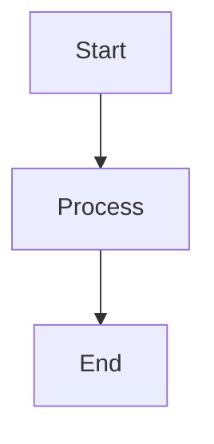

# MkDocs Structure Guide

This document provides a comprehensive overview of how the MkDocs documentation system is structured and configured in the Smart Glasses project.

## Table of Contents <!-- TOC -->

- [MkDocs Structure Guide](#mkdocs-structure-guide)
  - [Table of Contents](#table-of-contents-)
  - [Directory Structure](#directory-structure)
  - [Configuration Architecture](#configuration-architecture)
    - [1. Main Configuration (`config/mkdocs/mkdocs.yml`)](#1-main-configuration-configmkdocsmkdocsyml)
      - [Site Information](#site-information)
      - [File Structure](#file-structure)
      - [Theme Configuration](#theme-configuration)
      - [Markdown Extensions](#markdown-extensions)
      - [Plugins](#plugins)
    - [2. Docker Configuration (`config/mkdocs/Dockerfile`)](#2-docker-configuration-configmkdocsdockerfile)
      - [Base Image](#base-image)
      - [Dependencies](#dependencies)
      - [File Structure Setup](#file-structure-setup)
      - [Service Configuration](#service-configuration)
    - [3. Service Orchestration (`docker-compose.yaml`)](#3-service-orchestration-docker-composeyaml)
      - [Service Definition](#service-definition)
  - [Content Organization](#content-organization)
  - [Development Workflow](#development-workflow)
    - [1. Local Development](#1-local-development)
    - [2. Content Creation](#2-content-creation)
    - [3. Configuration Updates](#3-configuration-updates)
  - [Advanced Features](#advanced-features)
    - [Mermaid Diagrams](#mermaid-diagrams)
    - [Code Highlighting](#code-highlighting)
    - [Admonitions](#admonitions)
  - [Customization Points](#customization-points)
    - [Theme Customization](#theme-customization)
    - [Navigation Structure](#navigation-structure)
    - [Plugin Extensions](#plugin-extensions)
  - [Deployment Considerations](#deployment-considerations)
    - [Production Deployment](#production-deployment)
    - [Performance Optimization](#performance-optimization)
    - [Security](#security)
  - [Troubleshooting](#troubleshooting)
    - [Common Issues](#common-issues)
    - [Debug Mode](#debug-mode)
    - [Log Access](#log-access)

## Directory Structure

```text
SmartGlasses/
├── config/mkdocs/              # MkDocs configuration files
│   ├── mkdocs.yml              # Main MkDocs configuration
│   └── Dockerfile              # Docker container definition
├── docs/                       # Documentation content
│   ├── architecture/           # Architecture design docs
│   ├── development/            # Development guides & tools
│   ├── getting-started/        # Onboarding guides
│   ├── resources/              # Project assets (posters, wireframes)
│   └── index.md                # Documentation homepage
├── assets/                     # Static assets (images, logos, etc.)
│   ├── favicon.ico             # Site favicon
│   └── smart_glasses_logo.webp # Project logo
├── docker-compose.yaml         # Service orchestration
└── README.md                   # Project root documentation
```

## Configuration Architecture

### 1. Main Configuration (`config/mkdocs/mkdocs.yml`)

This is the heart of the MkDocs setup, defining:

#### Site Information

```yaml
site_name: Documentation - Smart Glasses
site_description: Comprehensive documentation for the Smart Glasses project
site_author: Simon Stijnen
repo_url: https://github.com/vives-project-xp/SmartGlasses
copyright: Copyright &copy; 2025 Vives
```

#### File Structure

```yaml
docs_dir: /docs  # Points to the documentation root directory
```

#### Theme Configuration

The documentation uses Material for MkDocs as its base theme, configured with a red primary color and pink accent color scheme. The theme automatically detects the user's system preference for dark or light mode while providing a manual toggle for overriding this preference.

Several advanced features are enabled to enhance navigation and usability, including navigation tabs and sections for better content organization, an integrated table of contents for quick reference, search suggestions with result highlighting, code copying capabilities with annotations, and linked content tabs for organizing related information.

#### Markdown Extensions

The documentation leverages several markdown extensions to enhance content presentation. Syntax highlighting is provided by `pymdownx.highlight` with line number support, while code features include inline highlighting, snippets, and superfences for advanced code block formatting. Mermaid diagram support is enabled through custom fences, allowing developers to create diagrams directly in markdown. Content is further enhanced with support for tables, admonitions, and footnotes. Navigation is streamlined through an automatically generated table of contents with permalinks for easy reference sharing.

#### Plugins

- **Search**: Full-text search functionality

### 2. Docker Configuration (`config/mkdocs/Dockerfile`)

The containerization strategy includes:

#### Base Image

```dockerfile
FROM python:3.11-alpine
```

The Docker container is built on a lightweight Alpine Linux base with Python 3.11, providing modern compatibility while minimizing the image size.

#### Dependencies

```dockerfile
RUN pip install --no-cache-dir mkdocs-material
```

The container installs the MkDocs Material theme, which includes the core MkDocs package. The installation uses the `--no-cache-dir` flag to minimize the final image size by avoiding unnecessary cached files.

#### File Structure Setup

```dockerfile
WORKDIR /docs
COPY config/mkdocs /config
COPY /assets /docs/assets
COPY /README.md /docs/README.md
COPY /docs /docs
```

#### Service Configuration

```dockerfile
EXPOSE 8000
CMD ["mkdocs", "serve", "--config-file", "/config/mkdocs.yml", ...]
```

### 3. Service Orchestration (`docker-compose.yaml`)

#### Service Definition

```yaml
services:
  docs:
    container_name: docs
    build:
      context: .
      dockerfile: config/mkdocs/Dockerfile
    restart: unless-stopped
    user: "${UID:-1000}:${GID:-1000}"
    ports:
      - "8085:8000"
    environment:
      - ENABLE_LIVE_RELOAD=true
```

**Key Features**:

The service maps external port 8085 to the internal container port 8000, making the documentation accessible at localhost:8085. User mapping is configured to preserve file permissions by matching the host user and group IDs, preventing permission conflicts when editing documentation files. The container is configured to automatically restart unless manually stopped, ensuring the documentation remains available even after system reboots. Live reload is enabled for development convenience, automatically refreshing the browser when documentation changes are detected.

## Content Organization

Documentation files are stored in the `/docs` directory, organized by topic or project component. Each section can contain multiple Markdown files, which MkDocs automatically converts into a navigable website.

Assets are copied into the Docker container at build time and referenced in the MkDocs configuration, making them accessible to all documentation pages throughout the site.

## Development Workflow

### 1. Local Development

Start the documentation server using `docker-compose up docs`. Once running, access the documentation at <http://localhost:8085>. The development server monitors file changes and automatically reloads them in your browser, providing immediate feedback as you write and edit documentation.

### 2. Content Creation

Create new documentation by adding Markdown files to the `/docs` directory. Write your content using standard Markdown syntax, and reference any images or other assets from the `/assets` directory to keep your documentation well-organized and maintainable.

### 3. Configuration Updates

To update the MkDocs configuration, modify the `config/mkdocs/mkdocs.yml` file. If your changes affect the Docker container setup, rebuild the container using `docker-compose build docs` followed by `docker-compose up docs` to apply the changes.

## Advanced Features

### Mermaid Diagrams

Enabled through configuration:

```yaml
markdown_extensions:
  - pymdownx.superfences:
      custom_fences:
        - name: mermaid
          class: mermaid
          format: !!python/name:pymdownx.superfences.fence_code_format
```

Usage in Markdown:

````markdown

````

Result:


### Code Highlighting

Multiple programming languages supported:

````markdown
```python
def hello_world():
    print("Hello, Smart Glasses!")
```
````

Result:

```python
def hello_world():
    print("Hello, Smart Glasses!")
```

### Admonitions

Enhanced content blocks:

```markdown
!!! note "Important Information"
    This is a note admonition block.

!!! warning
    This is a warning block.
```

Result:

!!! note "Important Information"
    This is a note admonition block.

!!! warning
    This is a warning block.

## Customization Points

### Theme Customization

Customize the documentation theme by adjusting colors and branding settings in the `mkdocs.yml` configuration file. For more advanced styling needs, you can add custom CSS through theme overrides. The project logo and favicon can be replaced by updating the corresponding asset files referenced in the configuration.

### Navigation Structure

By default, MkDocs automatically generates the navigation structure from your file organization. However, you can manually override this by defining a custom navigation hierarchy in the `mkdocs.yml` nav section, allowing you to control section grouping and page ordering to better suit your documentation flow.

### Plugin Extensions

Extend MkDocs functionality by installing additional plugins through `pip install` commands in the Dockerfile. Configure these plugins in the `mkdocs.yml` file to enable their features. For unique requirements, custom plugin development is also possible within the MkDocs framework.

## Deployment Considerations

### Production Deployment

For production deployment, generate a static site using the `mkdocs build` command. The resulting static files can be served by any standard web server such as Nginx or Apache. Consider integrating the build process into your CI/CD pipeline to automatically generate and deploy documentation updates whenever changes are committed.

### Performance Optimization

Optimize documentation performance by compressing and optimizing assets before including them in your documentation. Fine-tune the search index configuration to balance search quality with load times. Carefully select and configure only the plugins you actually need, as each additional plugin can impact build and load performance.

### Security

The static site approach provides inherent security benefits since no server-side processing is required, significantly reducing the attack surface compared to dynamic documentation systems. Running the development server in a Docker container provides additional isolation, keeping the documentation environment separate from the host system.

## Troubleshooting

### Common Issues

1. **Port Conflicts**: Change port mapping in `docker-compose.yaml`
2. **Permission Issues**: Check UID/GID mapping in Docker Compose
3. **Build Failures**: Verify Dockerfile syntax and dependencies
4. **Configuration Errors**: Validate YAML syntax in `mkdocs.yml`

### Debug Mode

Enable verbose logging:

```bash
# In Dockerfile CMD
mkdocs serve --config-file /config/mkdocs.yml --verbose
```

### Log Access

```bash
# View container logs
docker-compose logs docs

# Follow logs in real-time
docker-compose logs -f docs
```

This structure provides a robust, scalable documentation system that grows with the Smart Glasses project while maintaining simplicity for contributors.
