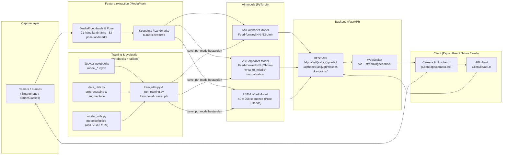

# Software Architectuur: AI-Componenten

## Inleiding & Scope

### Projectbeschrijving

Het **Signapse** project is een toegankelijkheidsoplossing die gebarentaal vertaalt naar tekst met behulp van een app op een mobiele telefoon. Het systeem maakt gebruik van computer vision en deep learning om handgebaren en gebarentaal in real-time te herkennen en te interpreteren.

### Scope van dit document

Dit document beschrijft uitsluitend de **AI-componenten** en hun integratie binnen de totale software-architectuur van het Signapse project. De focus ligt op:

- De deep learning modellen (ASL, VGT, LSTM)
- De MediaPipe feature extraction pipeline
- De API-laag die de AI-functionaliteit aanbiedt
- De gebruikte technologieën en frameworks

Voor een deep-dive in het `smart_gestures` package, model lifecycle en alle CLI-opties, zie [AI-Packages.md](../../getting-started/AI-Packages.md).

## Overzicht Architectuur

### High-level AI-architectuur

Het Signapse AI-systeem bestaat uit een **multi-model pipeline** die verschillende soorten gebaren kan herkennen:

1. **Alfabet-herkenning**: Individuele letters in American Sign Language (ASL) en Vlaams Gebarentaal (VGT)
2. **Woord-herkenning**: Volledige woorden via sequentiële keypoint-analyse met LSTM

Alle modellen zijn gebundeld in het `smart_gestures` Python package en worden aangeboden via een FastAPI backend.

### Contextdiagram

## AI-Componenten

De specifieke AI-componenten worden in detail beschreven in de volgende secties:

- [MediaPipe Keypoint-extractie](mediapipe.md)
- [ASL Alfabet Model](asl-model.md)
- [VGT Alfabet Model](vgt-model.md)
- [LSTM Woord/Gebaar Model](lstm-model.md)

Zie ook:

- [Gebruikte Technologieën en Frameworks](tech-stack.md)
- [Kwaliteitsaspecten & Uitbreidbaarheid](quality-extensibility.md)

## Conclusie

De AI-architectuur van het Signapse project combineert **moderne deep learning technieken** met **pragmatische software engineering**:

- **MediaPipe** als robuuste feature extractor
- **PyTorch feed-forward networks** voor snelle alfabet-herkenning (ASL + VGT)
- **PyTorch LSTM** voor contextuele woord-herkenning
- **Modulaire package-structuur** voor eenvoudige uitbreidbaarheid
- **REST API** voor platform-agnostische integratie
- **Real-time performance** op CPU-only devices

De architectuur is ontworpen met **schaalbaarheid** en **onderhoudbaarheid** in gedachten, waardoor nieuwe modellen, talen of functies eenvoudig toegevoegd kunnen worden zonder grote refactoring.

---

**Document-informatie**:

- **Versie**: 1.3
- **Datum**: December 2025
- **Auteurs**: Lynn Delaere
- **Contact**: Zie [GitHub repository](https://github.com/vives-project-xp/Signapse)
