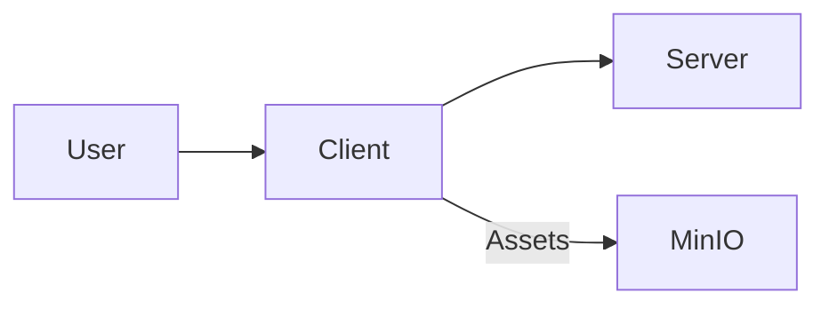

## Client — Executive Summary

The client is the user-facing application that runs on a developer’s machine or a device. It is built with React (Expo in this repository) and connects to the server for data, streaming, and control flows.

## Technology Deep Dive (The "What")

React is a component-driven JavaScript library for building user interfaces. With Expo, React Native developers get tools that simplify building and deploying to mobile or device-like environments; Expo provides a managed workflow and dev server that reloads changes instantly during development. These development tools emphasize component composition, unidirectional data flow, and a declarative approach to UI.

Core concepts of modern front-end development include components (reusable units of UI), state and props (data flow into components), and the virtual DOM (a lightweight in-memory representation used to compute efficient updates). For device-oriented apps, features like camera access, permissions, and native modules are important; Expo wraps those concerns into a predictable set of APIs.

React and Expo are widely used because they speed up development and allow sharing significant code between platforms, which is ideal for prototyping and iterating interactive experiences such as those used by Signapse.

## Service Implementation (The "Why Here")

In Signapse the client captures camera frames, displays prediction overlays, and sends input to the server for inference. It also consumes realtime messages via WebSocket to show live feedback. The client is the environment where users interact with the models and application features, so it is optimized for low-latency UI and quick feedback loops.

Example: When the user activates the camera, the client collects frames, optionally extracts keypoints locally, and sends them to the server for further processing. The UI displays the returned label or gesture prediction.

## Usage Guide (The "How")

Start the client service with Docker Compose or using the local development server for faster iteration.

```bash
# Start the client service
docker compose up -d client

# Or, run the development server locally (requires node & yarn/npm)
cd client
npm install
npm run start
```

The `docker compose` command spins up the packaged client container. Running the dev server locally gives fast reloads and direct access to development tooling.

**Configuration Reference**

| Variable | Default Value | Description |
|---|---:|---|
| PORT | 3000 | Port for the Metro / dev server |
| EXPO_DEVTOOLS_LISTEN_ADDRESS | 0.0.0.0 | Devtools listen address for device connection |

**Access**

When running via Compose the client is reachable at <http://localhost:3000> (web). For mobile emulators or devices use the Expo app to connect to the dev server.

## Connections (The Ecosystem)

The client communicates with the server over REST and WebSocket connections. It also interacts with model services indirectly by requesting inferences from the server, and consumes object storage (MinIO) links for media when necessary.


