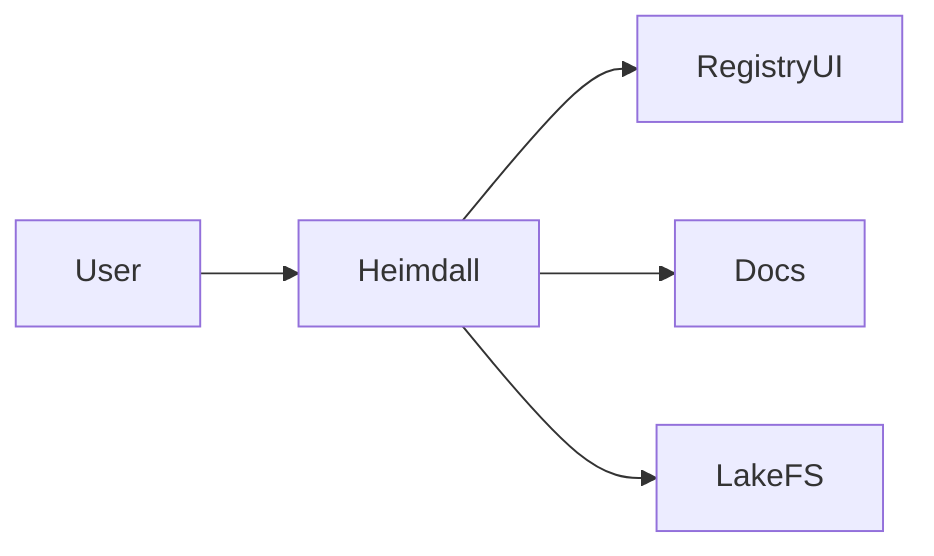

## Heimdall — Executive Summary

Heimdall is a self-hosted application dashboard that aggregates links to services and makes it easy to start day-to-day tooling from a single web page. It is lightweight and designed to provide quick access to locally hosted services.

## Technology Deep Dive (The "What")

Heimdall is an application dashboard rather than a platform service; it maintains a simple configuration that maps icons and links to service endpoints. The tool acts as a convenience layer that helps developers and operators locate service UIs quickly.

Key concepts include a central configuration for bookmarks, user-friendly icons and a single page that aggregates service health links. Because it is not a proxy, Heimdall does not route traffic; it simply links to the services you run and can optionally display very basic status indicators.

Heimdall is useful because it reduces cognitive load on teams by creating a consistent entry point for UIs across many services.

## Service Implementation (The "Why Here")

Within the Signapse workspace, Heimdall provides an always-available entry page that lists the registry, documentation, and monitoring UIs. It runs as a simple container that mounts a data directory for configuration.

Example: Add a shortcut for the lakeFS console and the registry UI so team members can find them from a single dashboard.

## Usage Guide (The "How")

Start Heimdall and visit the dashboard.

```bash
# Start Heimdall
docker compose up -d heimdall

# Open the dashboard at http://localhost
```

**Configuration Reference**

| Variable | Default Value | Description |
|---|---:|---|
| PUID | 1000 | User id used by container processes |
| PGID | 1000 | Group id used by container processes |
| TZ | Europe/Brussels | Time zone setting for the container |

**Access**

Heimdall listens on port 80 and is typically accessible at <http://localhost> when the container is running.

## Connections (The Ecosystem)

Heimdall links to services but does not depend on them. It provides a convenient human-facing entry point to services such as the Registry UI, lakeFS, and the docs site.


