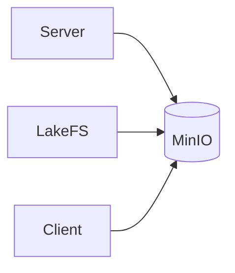

## MinIO — Executive Summary

MinIO provides an S3-compatible object storage API used for storing blobs and media. It is a lightweight, cloud-native alternative for local testing and small deployments.

## Technology Deep Dive (The "What")

MinIO implements the Amazon S3 object storage API and exposes a simple key/object model for storing binary data. Unlike block or relational storage, object stores organize data into buckets and objects which are immutable by default and addressed by keys. MinIO supports strong consistency semantics for object writes and is designed for high performance and simplicity.

Core concepts relevant to MinIO are buckets (logical containers for objects), access keys (credentials that identify a client), and S3-compatible API operations (GET, PUT, DELETE, LIST). Because it is protocol-compatible with S3, MinIO can be used with existing S3-aware tools and libraries.

MinIO is commonly used in development environments as an easy-to-run substitute for cloud S3 services due to its compatibility and small operational footprint.

## Service Implementation (The "Why Here")

Signapse uses MinIO as the object store for media (captured images, model artifacts, and dataset storage). When the server or lakeFS needs to store a large binary file, it uploads it to MinIO and then stores metadata (like object paths) in Postgres or lakeFS.

Example: When the client uploads an image for processing, it may be stored as an object in MinIO and the returned object URL persisted in the application database.

## Usage Guide (The "How")

Start MinIO and access the console or the S3-compatible API.

```bash
# Start MinIO via the Notebooks compose file
docker compose -f notebooks/docker-compose.yml up -d minio

# Check health
curl -f http://localhost:9000/minio/health/ready

# Access the web console at http://localhost:9001
```

The MinIO console is available on port 9001 and the S3 API on port 9000. Use the access key and secret to authenticate with the S3 API or compatible clients.

**Configuration Reference**

| Variable | Default Value | Description |
|---|---:|---|
| MINIO_ROOT_USER | (required) | Root access key used by MinIO |
| MINIO_ROOT_PASSWORD | (required) | Root secret for the access key |

**Access**

The S3 API is reachable at <http://localhost:9000> and the web console at <http://localhost:9001> when running locally with the provided `notebooks/docker-compose.yml`.

## Connections (The Ecosystem)

MinIO is the blockstore for lakeFS and serves static assets for the server and client. It is typically accessed through S3-compatible SDKs and, in this project, by lakeFS configured to use the MinIO endpoint.


