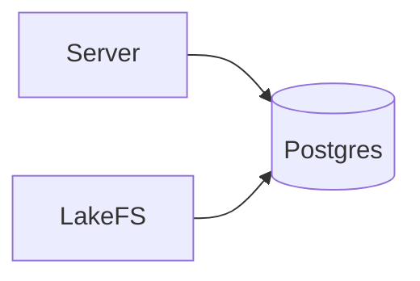

## Postgres — Executive Summary

Postgres is a relational database used for storing structured, ACID-compliant data. It provides durable storage for things like user data, application state and metadata that require transactional integrity.

## Technology Deep Dive (The "What")

PostgreSQL is a widely used open-source relational database management system (RDBMS). It supports the SQL standard plus many extensions for complex queries, transactions, and data types. A key property of Postgres is ACID compliance—Atomicity, Consistency, Isolation, Durability—which ensures that transactions are processed reliably even in the case of failures.

Core concepts include schemas (logical namespaces for tables), transactions (a sequence of operations that either fully succeed or fail), and WAL (Write-Ahead Logging) used for durability and crash recovery. Postgres also supports rich indexing, triggers, and extensions that make it a flexible choice for many server-side workloads.

Postgres is an industry-standard choice for relational workloads because it combines reliability, performance, and a rich feature set that meets both simple and advanced application requirements.

## Service Implementation (The "Why Here")

In this project Postgres stores persistent metadata and application state. For example, user or session records and any structured data the server needs are persisted in Postgres to guarantee consistency and allow complex queries.

Example: A model inference job result record is inserted within a transaction—if any part of the save fails the transaction rolls back to prevent partial writes.

## Usage Guide (The "How")

Start and interact with the Postgres container using Docker Compose and `psql`.

```bash
# Start Postgres
docker compose -f notebooks/docker-compose.yml up -d postgres

# Wait for readiness
docker compose exec postgres pg_isready -U lakefs

# Open a psql session
docker compose exec postgres psql -U lakefs -d lakefs
```

Use `pg_isready` to probe the server readiness and `psql` for interactive SQL. The `docker compose` command starts the service defined in the `notebooks` compose file.

**Configuration Reference**

| Variable | Default Value | Description |
|---|---:|---|
| POSTGRES_USER | lakefs | Database superuser name for the container |
| POSTGRES_PASSWORD | lakefs | Password for the `POSTGRES_USER` |
| POSTGRES_DB | lakefs | Default database created on container start |

**Access**

The Postgres service listens on its container port (5432). When using Docker Compose as provided in the notebooks environment, access is available to other containers by service name `postgres:5432`.

## Connections (The Ecosystem)

Postgres is used by lakeFS and application backends that require relational persistence. It is typically deployed behind a dedicated network so the server and other trusted services can connect using stable DNS names.


