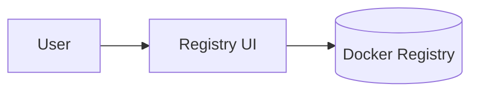

## Registry UI — Executive Summary

The Registry UI provides a web interface for browsing and managing images stored in the Docker Registry. It makes it easier to inspect tags, delete images, and see digest information without using the CLI.

## Technology Deep Dive (The "What")

Registry UI projects typically use a lightweight web frontend that communicates with a Docker Registry backend. The UI offers convenience features such as tag lists, tag details, and deletion controls. Although the registry exposes a REST API, a graphical interface reduces errors and provides a human-friendly view of stored repositories.

Core terms include repository, tag, digest and pagination; the UI calls registry endpoints to fetch catalogs and tag lists and displays them in a browser.

This approach is common because managing images solely via the CLI is error-prone; a UI helps teams audit and manage image lifecycles more safely.

## Service Implementation (The "Why Here")

In Signapse, the registry UI offers an accessible way to view and manage images in the local registry. A developer can quickly verify that a CI build pushed the expected tags, or remove obsolete images when disk usage grows.

Example: After a successful build, open the registry UI to confirm the new tag exists and view its content digest.

## Usage Guide (The "How")

Run the registry UI container and open the web interface.

```bash
# Start registry UI
docker compose -f notebooks/docker-compose.yml up -d registry-ui

# Open the UI at
open http://localhost:5001
```

**Configuration Reference**

| Variable | Default Value | Description |
|---|---:|---|
| SINGLE_REGISTRY | true | Single registry mode for the UI |
| REGISTRY_TITLE | Docker Registry UI | Display title for the UI |
| DELETE_IMAGES | true | Whether the UI allows deletion of images |

**Access**

The UI runs on port 5001 and is reachable at <http://localhost:5001> when running locally.

## Connections (The Ecosystem)

The Registry UI connects directly to the Docker Registry API and usually runs beside it. Users and CI systems interact with the registry; the UI is a convenience that makes inspection and management easier.


