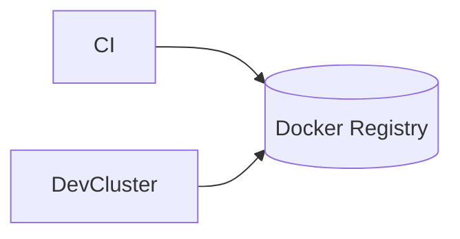

## Registry (Docker Registry) — Executive Summary

The Docker Registry stores container images in a private, local registry. It provides a place to push and pull images used by development and deployment workflows.

## Technology Deep Dive (The "What")

Docker Registry is the reference implementation of the container image distribution API. It stores image layers and manifests and provides endpoints for clients to push, pull, and list images. Registries can be public (Docker Hub) or private to an organization, and they enable reproducible deployments by providing specific image tags and digests.

Important concepts include repositories (collections of image tags), manifests (metadata describing an image's layers), and content-addressable storage (images referenced by digests to guarantee integrity). Private registries are often combined with authentication or network controls to keep images secure within a team or CI environment.

Using a local registry is common in development and CI because it reduces external dependencies and gives you control over image lifecycle and deletions.

## Service Implementation (The "Why Here")

Signapse uses a local registry for storing built images during development and for internal deployments. This makes it easy to test changes on the cluster without pushing images to an external service.

Example: An image built in CI can be pushed to the local registry and then pulled by the development cluster for testing.

## Usage Guide (The "How")

Interact with the registry using standard Docker CLI commands.

```bash
# Tag a local image and push it to the local registry
docker tag my-app:latest localhost:5000/my-app:latest
docker push localhost:5000/my-app:latest

# List catalog (if allowed)
curl -s http://localhost:5000/v2/_catalog | jq
```

The `docker push` command uploads image layers to the registry and the catalog endpoint lists available repositories when the registry allows it.

**Configuration Reference**

| Variable | Default Value | Description |
|---|---:|---|
| REGISTRY_HTTP_HEADERS_Access-Control-Allow-Origin | [http://edge-ai-11.tail539c2b.ts.net:5001] | CORS header value used in this compose example |
| REGISTRY_STORAGE_DELETE_ENABLED | true | Whether image deletion via API is allowed |

**Access**

The registry listens on port 5000 by default and is reachable at `localhost:5000` for pushes and pulls.

## Connections (The Ecosystem)

The registry is primarily a storage target for container images built by developers or CI, and it is consumed by clusters or local `docker pull` commands when testing or deploying services.


