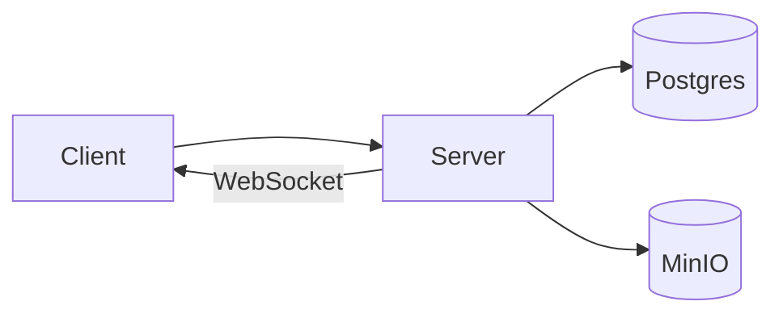

## Server — Executive Summary

The server provides the project's API and real-time endpoints. It is implemented as a Python web service and acts as the central coordinator for data storage, ML-inference requests, and WebSocket interactions.

## Technology Deep Dive (The "What")

The server is built using Python web frameworks (FastAPI is a common choice for projects like this). Modern Python web frameworks focus on asynchronous request handling, automatic OpenAPI generation and easy WebSocket integration. These features let developers expose both synchronous REST endpoints and long-lived connections for streaming or interactive use.

Key concepts include request/response lifecycles, routing, and middleware. Routing directs HTTP verbs and paths to handler functions, middleware can pre- or post-process requests (for logging, auth, or error handling), and WebSockets give a bidirectional connection for real-time events and low-latency feedback.

Web frameworks are used because they handle concurrency and provide well-defined patterns for serializing data and validating input; these qualities make them a standard choice for building reliable APIs quickly.

## Service Implementation (The "Why Here")

Within Signapse, the server coordinates camera frames, ML model inferences, and session state. For example, when the client captures keypoints or image frames, it sends them to the server for preprocessing or to forward to model inference components. The server also serves static or auxiliary routes for health checks and operational telemetry.

Example: The client posts a frame; the server validates the payload, enqueues work for an inference worker, and returns a task identifier to poll or subscribe to results via WebSocket.

## Usage Guide (The "How")

Interacting with the running server is straightforward using Docker Compose or curl. The following commands assume the Compose stack from the repository root.

```bash
# Start only the server service
docker compose up -d server

# Check logs
docker compose logs -f server

# Quick health check
curl -f http://localhost:8000/health
```

The first command launches the service; the second streams logs so you can follow startup; the curl command verifies the health endpoint responds as expected.

**Configuration Reference**

| Variable | Default Value | Description |
|---|---:|---|
| PORT | 8000 | Port the server listens on |
| WORKERS | (framework default) | Number of worker processes (if using a process manager) |

**Access**

The server is available at <http://localhost:8000> by default. API paths and the health endpoint are reachable there.

## Connections (The Ecosystem)

The server depends on storage and auxiliary services: Postgres for persistent data, MinIO for object storage, and the client which consumes its APIs. It also integrates with model inference services or message queues to process ML workloads.


