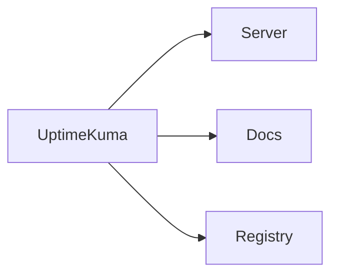

## Uptime-Kuma — Executive Summary

Uptime-Kuma is a self-hosted monitoring dashboard that checks service availability and notifies on failures. It provides a lightweight UI to track health checks for services in the stack.

## Technology Deep Dive (The "What")

Uptime-Kuma is an open-source monitoring tool with a focus on simple availability checks and alerts. It supports HTTP, TCP and other probe types and keeps a history of checks to help diagnose outages. The UI shows a list of monitors, their recent status, and historical uptime statistics.

Core concepts include monitors (the checks you configure), status pages (public or private views of uptime), and notifications (to e-mail or messaging tools). Uptime-Kuma's lightweight design makes it ideal for small teams that need a minimal monitoring solution.

Uptime-Kuma is often used because it is easy to self-host and configure, making it suitable for development environments where teams need basic alerting without complex setup.

## Service Implementation (The "Why Here")

Signapse uses Uptime-Kuma to continuously check critical endpoints such as the documentation site, server health endpoint, and registry. This gives developers early notice when a local or cluster service becomes unavailable.

Example: A monitor checks `http://localhost:8000/health` every minute and alerts when the health endpoint returns a non-OK status.

## Usage Guide (The "How")

Start the Uptime-Kuma container and configure monitors through the web UI.

```bash
# Start Uptime-Kuma
docker compose up -d uptime-kuma

# Open the UI at http://localhost:3001
```

The web UI is the primary interaction mechanism for configuring checks and notification channels.

**Configuration Reference**

| Variable | Default Value | Description |
|---|---:|---|
| PORT | 3001 | Web UI port for Uptime-Kuma |

**Access**

When running locally the Uptime-Kuma dashboard is reachable at <http://localhost:3001>.

## Connections (The Ecosystem)

Uptime-Kuma monitors other services in the environment and relies on network reachability to detect issues. It is an observer and does not alter service behavior.


